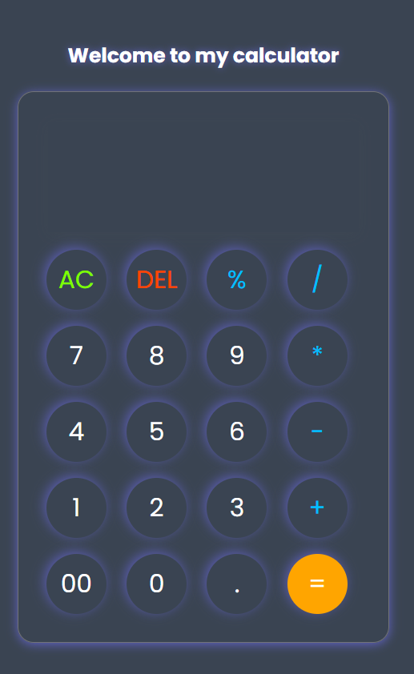

# 🧮 My Calculator
A simple and responsive calculator built using HTML, CSS and JavaScript.

## ✨ Features
- Basic arithmetic operations
- Addition, subtraction, multiplication and division
- Percentage calculation
- Decimal numbers
- AC(clear) button
- DEL button
- Respoonsive and clean UI

## 🛠️ Technologies Used
- HTML5
- CSS3
- JavaScript
## 📚 What I Learned
While building this project, I practiced:

- DOM manipulation
- Event handling
- Functions
- Working with user input
## 📷 Preview
